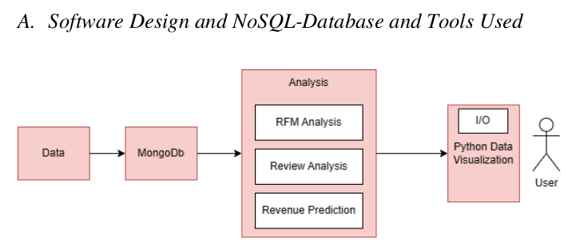
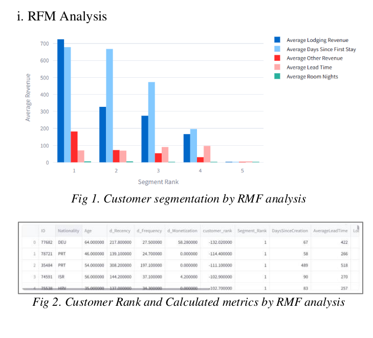
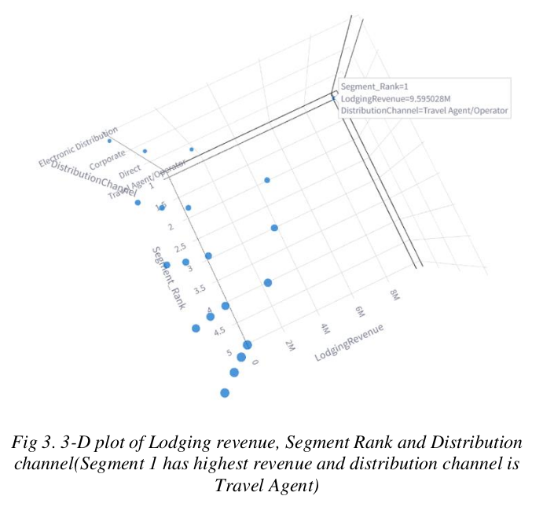
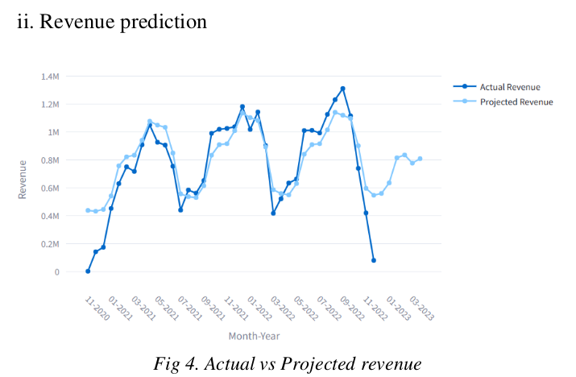
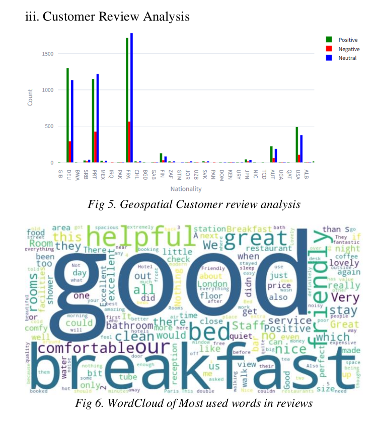

# Hotel Customer Dataset Analysis

Dataset is included as a part of the repo : `HotelCustomersDataset_WithReviews.csv`

## Instructions to compile and run

#### Step 0 : 
Setup the Mongo DB : Import the HotelCustomersDataset_WithReviews.csv file into MongoDB

#### Step 1 : venv setup

Create a python3 venv : https://docs.python.org/3/library/venv.html

#### Step 2 : Install dependencies (pip)

Inside the venv (activate it using source .venv/bin/ctivate), run ```pip install -r requirements.txt```

#### Step 3 : Run the application

To start the application, run ```streamlit run 0_RFM.py```

##### Refer the [Report](/Report.pdf) for full details about the poject. 


## Description

The aim of this project was to analyze a dataset using MongoDB and derive actionable insights. We analyze a CRM dataset from a hotel to predict ways of increasing the annual revenue of the hotel.

For every customer, the dataset contains attributes of nationality, age, average lead time, lodging revenue, other revenue, bookings cancelled, no-show, checked-in, days of last stay, customer review and more fields. We have individuals from 188 unique nationalities, and reviews as text. 

We have performed RFM analysis (Recency, Frequency and Monetary analysis) on the data using the DaysSinceLastStay, AverageLeadTime, Bookings Information, LodgingRevenue and OtherRevenue. Using the RFM analysis, we are able to segment customers into 5 different segments which can be used to analyze most valued customers and least valued customers. 

We analyze the customer reviews for positive and negative comments. Using marked reviews, we can see which word is used the most and we can take actions accordingly. To mark the review, check for positive and negative words in a review and weigh positive and negative words against each other and mark the review accordingly. 

Lastly, we have created a naïve revenue predictor over lodging revenue using average revenue by month and using Simple Moving Average for 6 data points.



### RFM (Recency, Frequency and Monetization) Analysis

An analytical approach known as RFM analysis was applied to gain insights into customer behavior. Recency, Frequency, and Monetization were considered, and respective attributes, d_Recency, d_Frequency, and d_Monetization, were derived and weighted and minimized or maximized appropriately to formulate a composite metric termed CustomerRank. Using CustomerRank, the customer base was divided into five groups/quartiles, each with a unique SegmentRank. Various attributes, such as lodging revenue, lead time and number of nights spent, were analyzed to identify the most valuable customer segments. The goal of this analysis is to identify the most valuable customer segment providing insights for decision making. Advertising to potential new customers is a critical function of maximizing revenue and looking at the distribution channel   (advertising medium) used for the top segment of customers (SegmentRank-1) provides insight into the best distribution channel that can be used for targeted marketing.





### Revenue Prediction (SMA) Analysis

The revenue prediction includes a systematic approach using the various MongoDB pipelines. First, we established a pipeline to calculate average monthly revenue using historical data using lodging revenue and other revenue attributes. All the generated data was stored in a MongoDB collection. Another pipeline was created, which uses simple moving average (SMA) over the past 6-month period from current month to forecast real-time earnings. Using lookups and comparing the current calculated data with the initial revenue estimate is done to increase accuracy which creates a mixture of historical insights.


### Sentiment Analysis of Customer Reviews
For analyzing sentiments of customer reviews for the hotel, a MongoDB pipeline was used to systematically extract and count words. This data is used in subsequent pipelines. Using a pre-existing dataset of positive and negative words, each word is classified as positive or negative, facilitating a basic understanding of sentiment of the word. Using these classifications, another MongoDB pipeline is used to categorize the whole review as positive or negative. To classify the review as positive or negative, we weighed the positive and negative words in the review and then classify the review accordingly. Using additional customer details, such as nationality, the analysis provides valuable insights into how different countries perceive the hotel experience.



##### Refer the [Report](/Report.pdf) for full details about the poject. 
